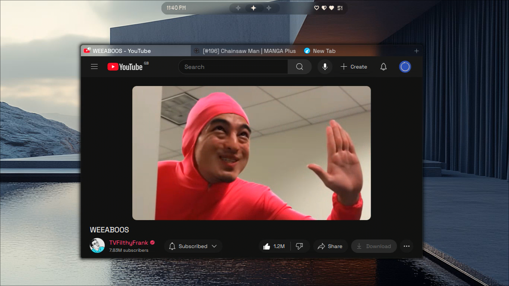

# Fuji Fox

Two things that I want for my browser: 
- **I want it to be clean and minimal**, clutter-free from things that I barely use.
- **I'd love to have that glassmorphism look for my browser**. That would be awesome.

So based on those two, I created this customization (purposely) for myself. But if you want to try, feel free to try it yourself.

Unfortunately, I was only able to test it on my Linux, since I don't use either Windows or macOS.\
I'm using Arch with Hyprland on top of it. If you're interested, feel free to check them out right [here](https://github.com/xeji01/hyprstellar).

> [!NOTE]\
> I have zero experience with coding or any programming language in general. So bear with me for the upcoming issues, 'cause it would be a bit challenging for me.

Especially since the recent updates, they always try to mess everything up. _**Yes, I'm looking at you, Mozilla**_.

Anyway, I'll do my best to keep maintaining this project since I use it as my daily driver as well.

## Feature Breakdown 🌟

| Full-width Tab (Safari Style) |
| --- |
| 

| Auto Hide Urlbar and Toolbar |
| --- |
|  

| Close Tab on Hover |
| --- |
|  |

| Hidden Extensions Icon | Compact Extensions Menu |
| --- | --- |
|  |  |

| Top Findbar |
| --- |
|  |

| Gradient URL Bar View |
| --- |
|  |

| Centered Bookmark |
| --- |
|  |

## Set-up Guide 🛠️

##### Step 1: Browser Configuration 

- In the URL bar, enter `about:config` (Accept the Risk and Continue).
- Adjust the configuration as per the following table:

| Configuration Parameter | Required Setting |
| ---- | ---- |
| `toolkit.legacyUserProfileCustomizations.stylesheets` | `true` |
| `browser.compactmode.show` | `true`  |

- In the customize toolbar menu set `density` to `compact` (bottom left corner).

##### Step 2: Theme Selection

- Enable `Dark` theme in Settings. Ensure it is not the `System theme - auto`.

##### Step 3: File Installation

- Enter `about:profiles` in the URL bar.
- Identify your current profile and click on `Open Directory` in the `Root Directory` section.
- Create a `chrome` folder if one doesn't already exist.
- Download the `userChrome.css` and move it to the `chrome` folder. 

Restart your browser to experience your new comfy browser! 💓🎉

> [!TIP]\
> You can change the font style and font size in the `userChrome.css`.

## Common Issues 🧰

### Overlap Between Tab Bar and URL Bar

- Increase or decrease the value of `--urlbar-height-setting` variable in `userChrome.css`.

### I want to display the Star Button for Bookmark

Still in the `userChrome.css`:

- Head to the **URL DEBLOAT** section, find `#star-button` line and change display: `none` to display `on`.

### I don't want to hide the Extension Icon
- Head to the **UNIFIED EXTENSIONS BUTTON** section, find `#unified-extensions-button` line and change the `opacity` to 100%.

## Credits

- This work took inspiration from [Dook97](https://github.com/Dook97/firefox-qutebrowser-userchrome)'s userChrome.
- [Mr.OtherGuy](https://github.com/MrOtherGuy/firefoxcss-hack) for amazing tweak references.
